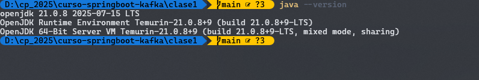
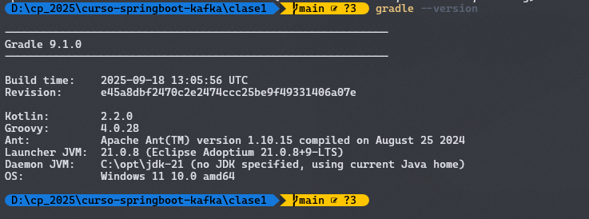
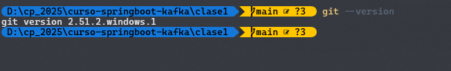
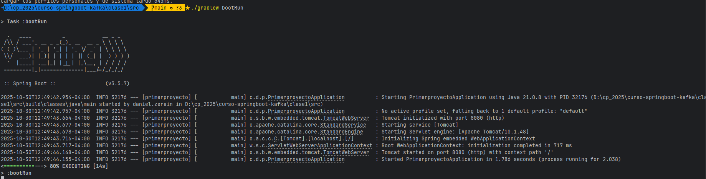

# Mi Primer Proyecto Spring Boot

## Información del Proyecto

- **Nombre:** Daniel Zerain Medinaceli
- **Versión de Spring Boot:** 3.5.7
- **Java:** 17
- **Build Tool:** Gradle

## Configuración del Ambiente de Desarrollo

**Java**



**Gradle**



GIT




## Estructura del Proyecto

Explica brevemente cada directorio/archivo:

### /src/main/java/com/dzerain/primerproyecto
- `PrimerproyectoApplication.java`

Esta clase es el punto de entrada principal de una aplicación desarrollada con springboot, la misma incluye la anotacion @SpringBootApplication que indica que esta clase es de configuración de spring y componentes y busca automáticamente los beans 

### src/main/resources/
- `application.properties`

Este es el archivo de configuración, se definen puertos, conexiones a bases de datos, logs, seguridad

### src/test/
En este directorio estan todos las clases destinadas para las pruebas unitarias

### build.gradle
Este es el archivo para el script de construcción de proyectos que usan Gradle como el sistema de compilación 

### build/
Aqui Gradle coloca todos los archivos generados automáticamente durante la construcción del proyecto de Spring Boot

## Cómo Ejecutar

```bash
./gradlew bootRun
```



## Dependencias Principales

Lista las dependencias en `build.gradle` y explica brevemente cada una:
- implementation 'org.springframework.boot:spring-boot-starter-web'
  - Incluye lo necesario para construir aplicaciones RESTful con Spring, Tomcat 

- testImplementation 'org.springframework.boot:spring-boot-starter-test'
  - Incluye las dependencias para realizar pruebas unitarias 


## Autor
Daniel Zerain - Curso Spring Boot & Kafka