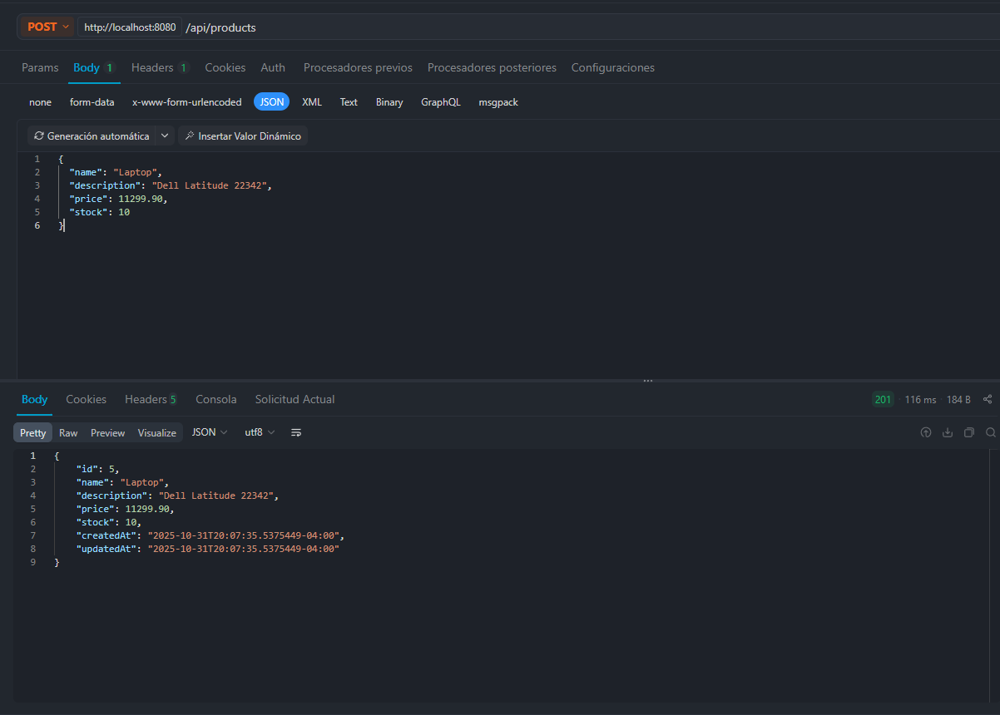
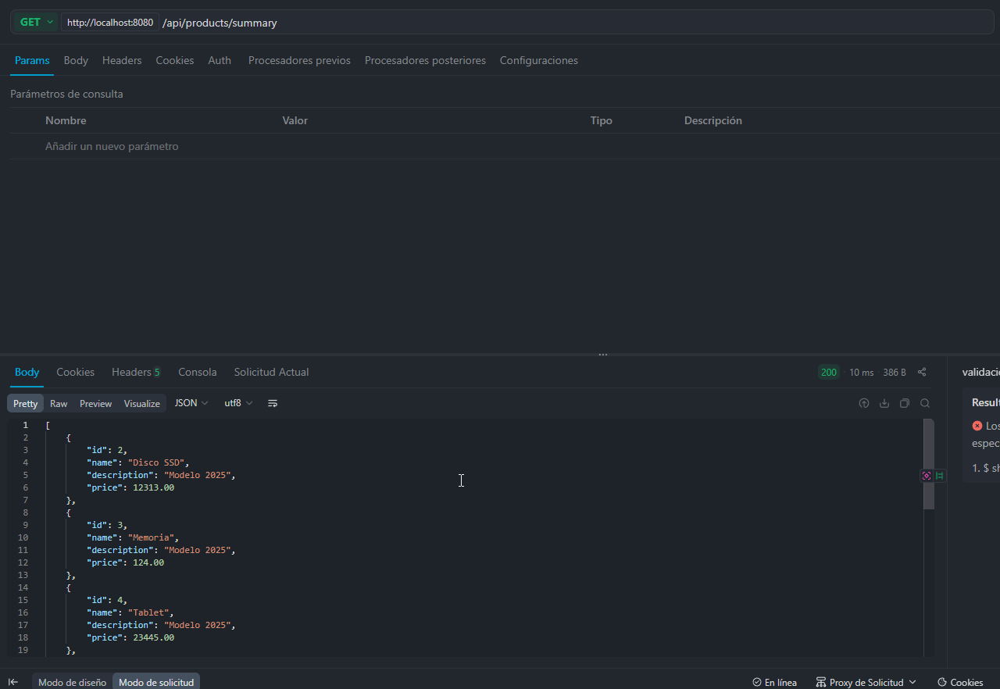
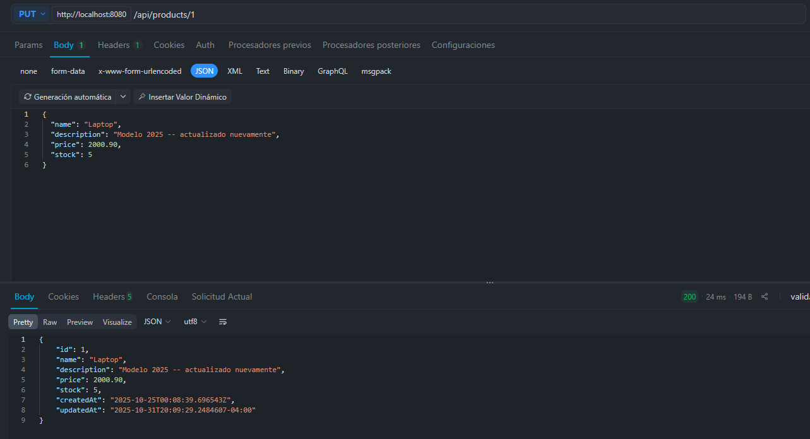
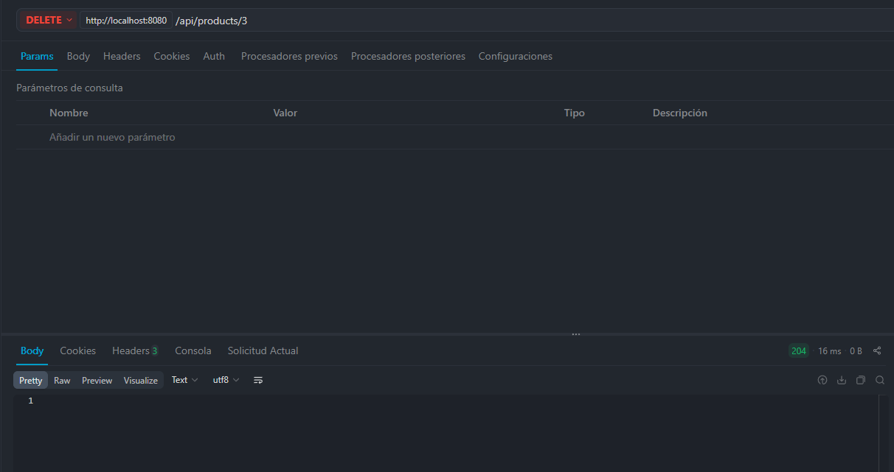
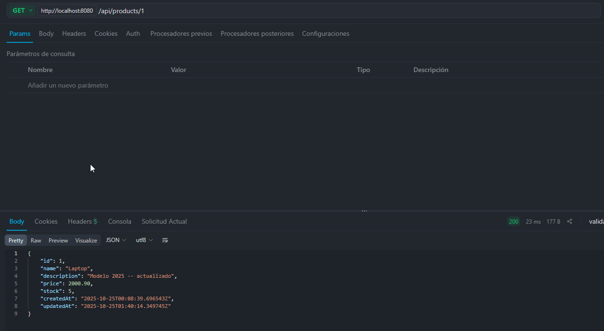

# Tarea 2 Spring Boot

## Información del Proyecto

- **Nombre:** Daniel Zerain Medinaceli
- **Versión de Spring Boot:** 3.5.7
- **Java:** 17
- **Build Tool:** Gradle

## CRUD basico de Productos

> **POST**

```curl
curl --location --request POST 'http://localhost:8080/api/products' \
--header 'Content-Type: application/json' \
--data-raw '{
  "name": "Laptop",
  "description": "Modelo 2025",
  "price": 1299.90,
  "stock": 5
}'
```



> **GET**

```curl
curl --location --request GET 'http://localhost:8080/api/products/1'
```



> **PUT**

```curl
curl --location --request PUT 'http://localhost:8080/api/products/1' \
--header 'Content-Type: application/json' \
--data-raw '{
  "name": "Laptop",
  "description": "Modelo 2025 -- actualizado",
  "price": 2000.90,
  "stock": 5
}'
```



> **DELETE**

```curl
curl --location --request DELETE 'http://localhost:8080/api/products/1'
```



> **GET**

```curl
curl --location --request GET 'http://localhost:8080/api/products/summary'
```



## Autor
Daniel Zerain - Curso Spring Boot & Kafka