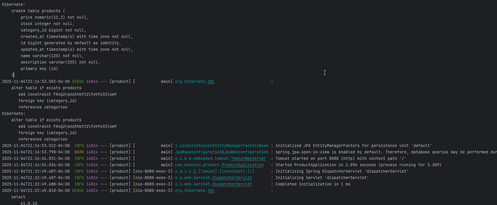
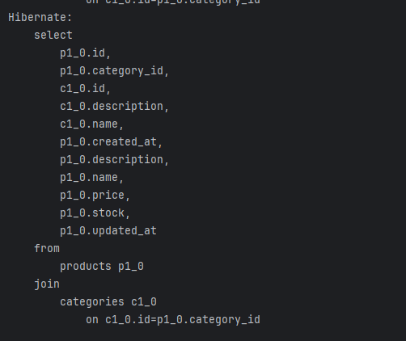
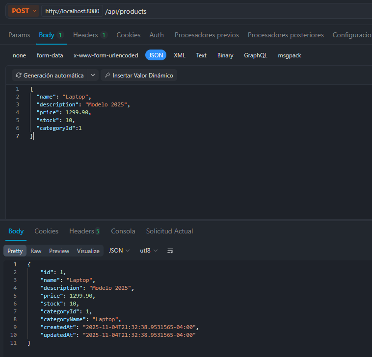
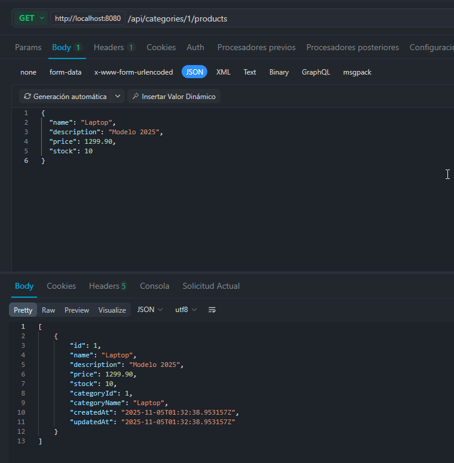
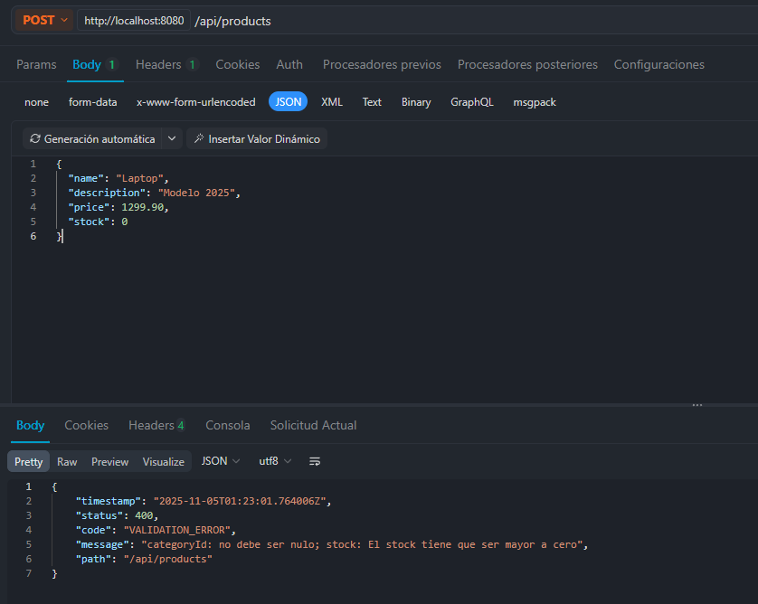
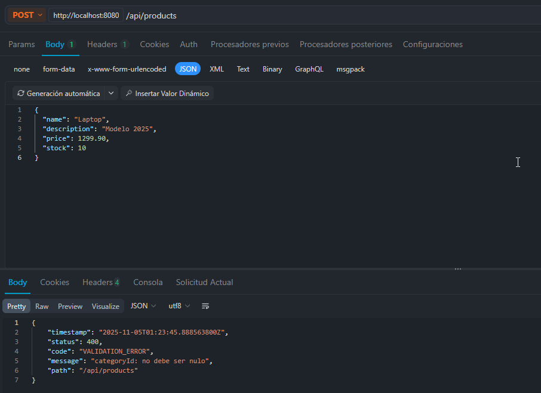
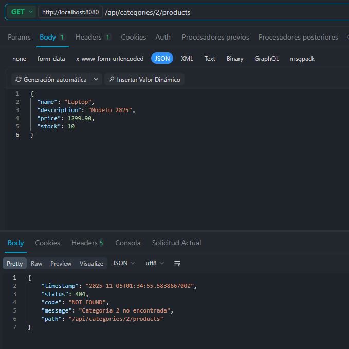
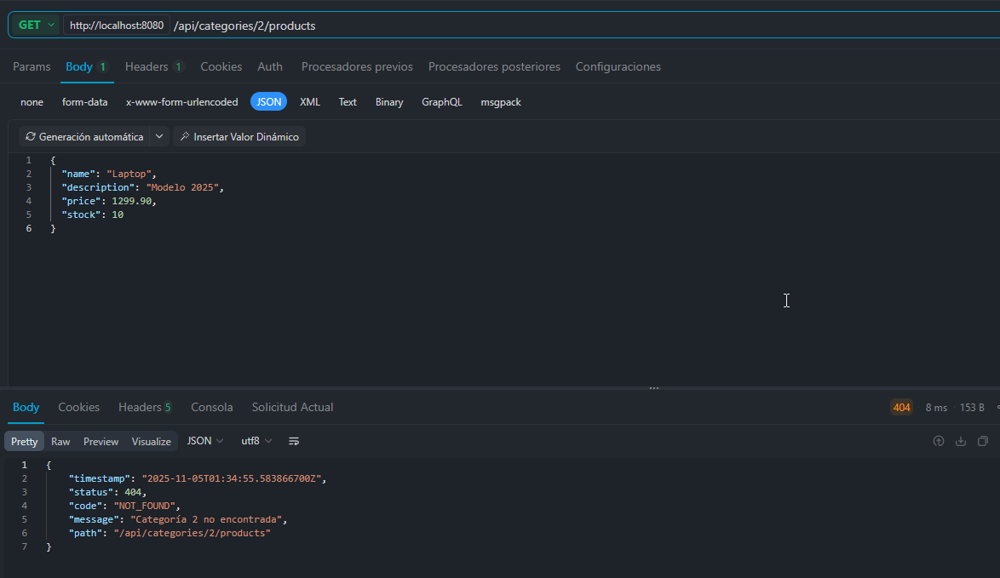

# Tarea 3 Spring Boot

## Información del Proyecto

- **Nombre:** Daniel Zerain Medinaceli
- **Versión de Spring Boot:** 3.5.7
- **Java:** 17
- **Build Tool:** Gradle

## CRUD basico de Productos

### Relación Product–Category

  > Se inicia el servidor, se configura para que se creen las tablas conforme a las entidades creadas

  > Se configuraron las relaciones entre las entidades

  > Registro con categoria

  

  > Relacion en respuesta de consulta

  

### Validaciones

  > Se configuraron las validaciones, para que el usuario no ingrese valores inadecuados

 > Se configuraron las validaciones incluida las relaciones con la categoria

### Manejo global de excepciones

  > Se configuraron las excepciones globales todos los mensaje de error retornaran con la misma estructura

