# Proyecto Final · E-commerce con Spring Boot y Kafka

**Alumno:** Daniel Zerain Medinaceli

**Fecha:** 26/11/2025

**Curso:** Spring Boot & Apache Kafka: Desarrollo de Microservicios y Mensajería en Tiempo Real- i-Quattro

## Arquitectura y estructura

### Requerimientos de Infraestructura

Previamente deberan levantar los contenedores de docker de Postgresql y de Kafka, en la carpeta [infraestructure](infraestructure/server/docker-compose.yml) encontrara el archivo docker-compose

Una vez se situe en la carpeta debera ejecutar el comando

```bash
docker compose up -d
```

Para terminar la configuracion de Kafka dirijase a la seccion [Kafka](#integracion-kafka)


### Compilacion y ejecucion

Se utilizo Gradle para la construccion, compilacion y ejecucion de los servicios, para su ejecucion se utilizaron los siguientes comando:

```bash
./gradlew bootRun --args='--spring.profiles.active=dev'
```

> En el comando se ve que se utiliza ***spring.profiles.active=dev***, con este argumento se define el profile con el que iniciara el servicio, en este ejemplo se inicia con el profile de dev

Los servicios se iniciaran mostrando el siguiente registro


Adicionalmente se habilita la generacion de imagenes para Docker para si du despliegue en contenedores

```bash
 docker build -t danielzerain/order_service:v.1.0.0 .
```

En el docker-compose debera establecer el profile=docker y crear archivos .env con la configuracion

```bash
services:
  order_service:
    container_name: order_service
    image: "danielzerain/order_service:v.1.0.0"
    environment:
      SPRING_PROFILES_ACTIVE: docker
      JAVA_OPTS: "-Xms256m -Xmx512m -XX:MaxMetaspaceSize=128m"
    ports:
      - 8001:8001
    env_file:
      - .env_order
    networks:
      - cursoksb_network
```

El archivo .env_order debera tener los valores

```bashSERVER_PORT=8001
DB_HOST=ecommerce-db
DB_PORT=5432
DB_NAME=ecommerce_orders
DB_USER=ecommerce_user
DB_PASSWORD=ecommerce_password
DLL-AUTO=update
JPA_SHOW_SQL=false
KAFKA_BOOTSTRAP_SERVERS=kafka:9092
```

### Microservicios

Se crearon 3 Microservicios para la gestion de las ordenes generadas en el Ecommerce, cada una conectada a su propia base de datos, se gestiona el bus de eventos con  Apache Kafka

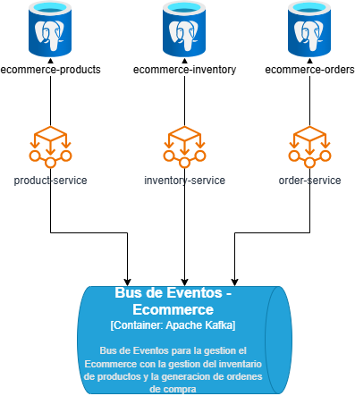

**product-service**

En este servicio se gestionan los productos y sus categorias, expone dos api

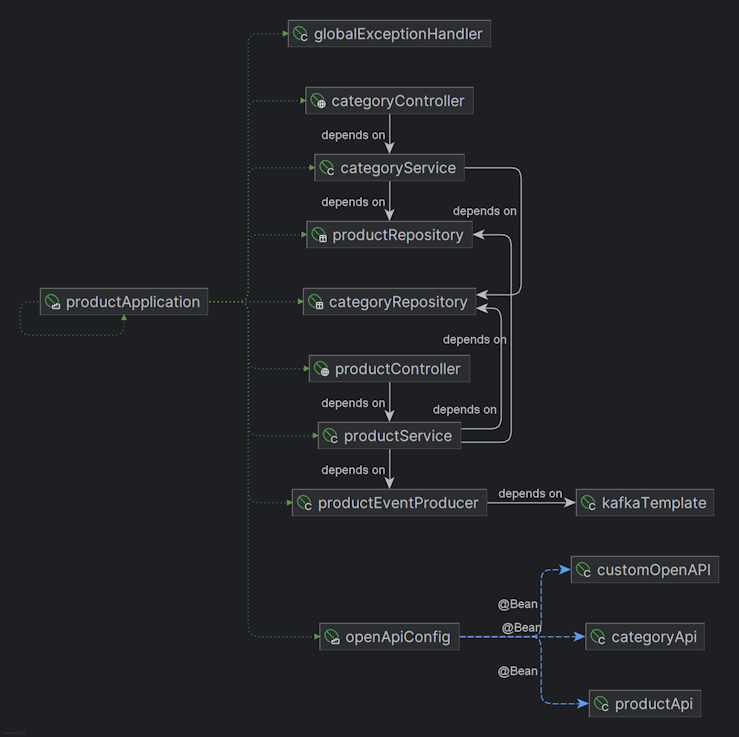


**inventory-service**

En este servicio se gestionan el inventario de los productos

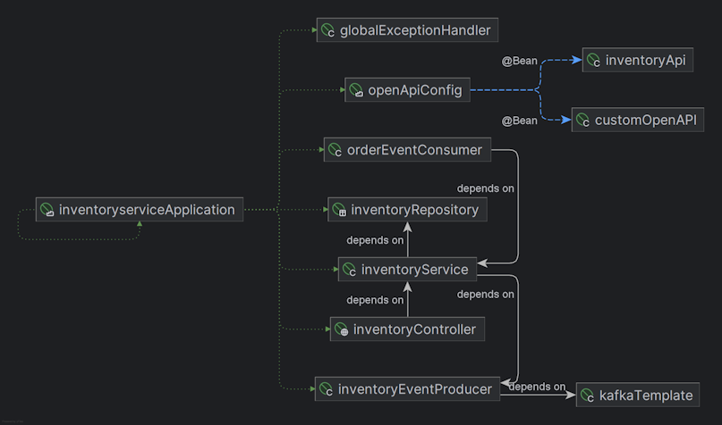

**order-service**

En este servicio se gestionan las ordenes de compra de los productos

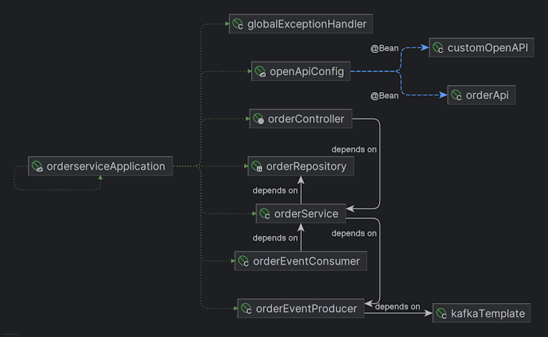

## Funcionalidad REST

Todos los servicios tienen los endpoint basicos de un CRUD

**product-service**

Este microservicio tiene dos servicios el de categorias y de producto 

***Servicio de Categoria***

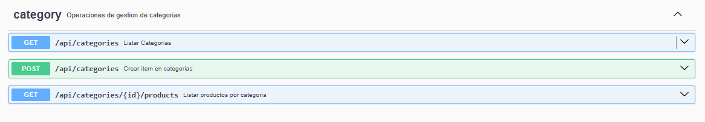

Cuenta con 3 endpoint para la consulta y el registro de las categorias

***Servicio de Producto***

Cuenta con 6 endpoint que permiten el registro, modificacion, eliminacion y consulta de los productos registrados


**inventory-service**

El servicio cuenta con 5 endpoint quie permiten el registro, eleiminacion y consulta de los items del inventario

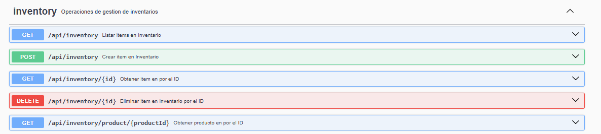

Se muestra la secuencia que sigue el proceso principal de este servicio que es la creacion el item en el inventario 

.png)

**order-service**


Se muestra la secuencia que sigue el proceso principal de este servicio que es la creacion de la orden 

.png)

### Flujo completo del Ecommerce

- Creacion de categorias

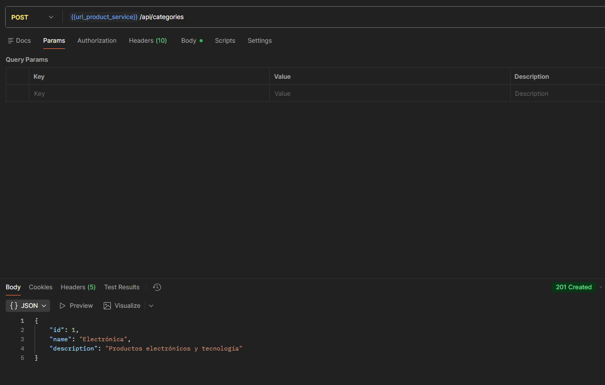

- Creacion de productos

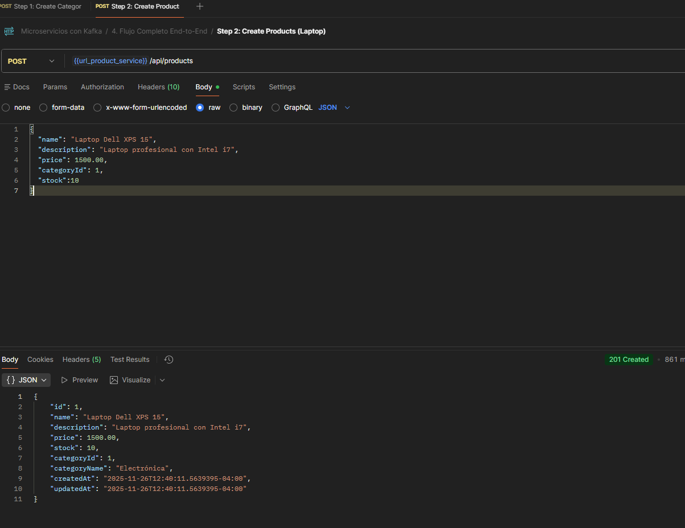

- Creacion de inventario

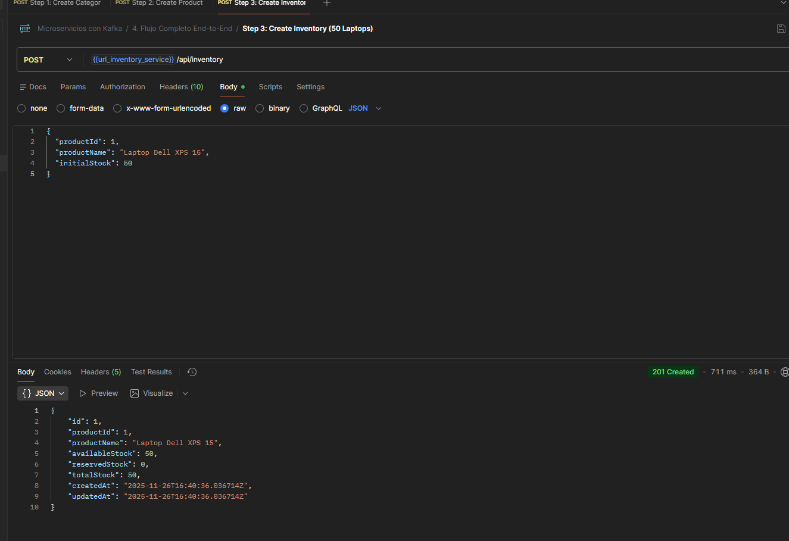

- Creacion de Orden

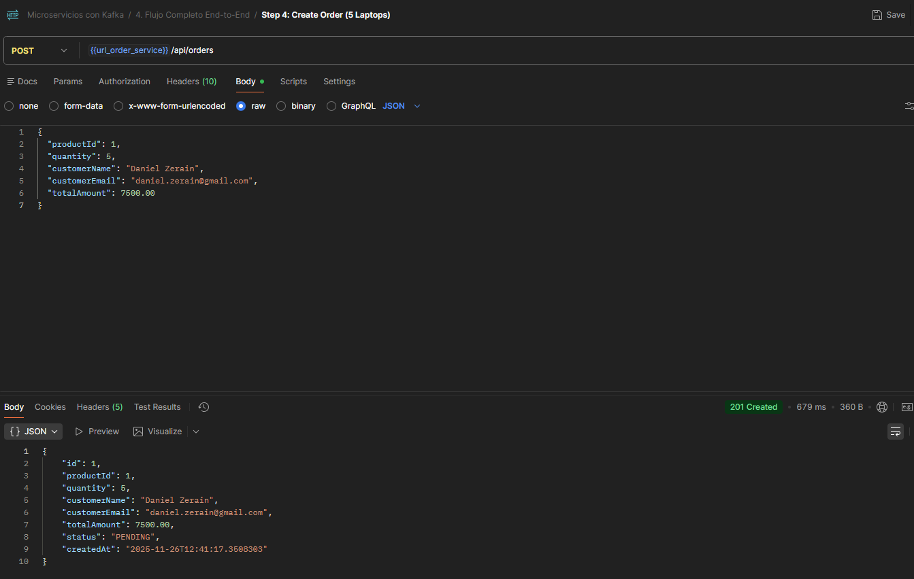

- Verificacion de Orden

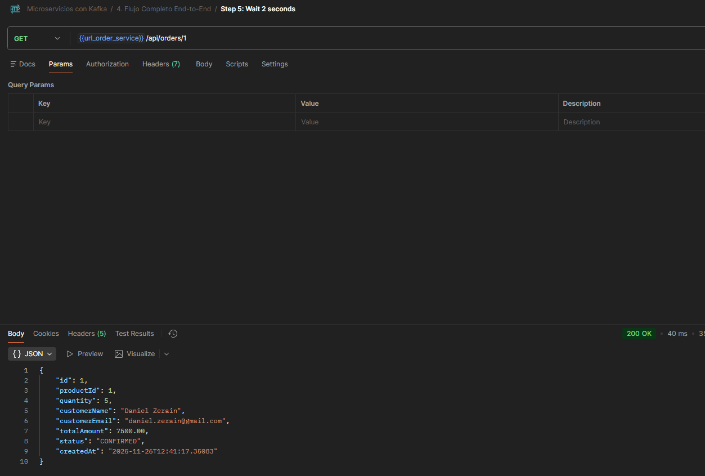

- Verificacion del estado del inventario

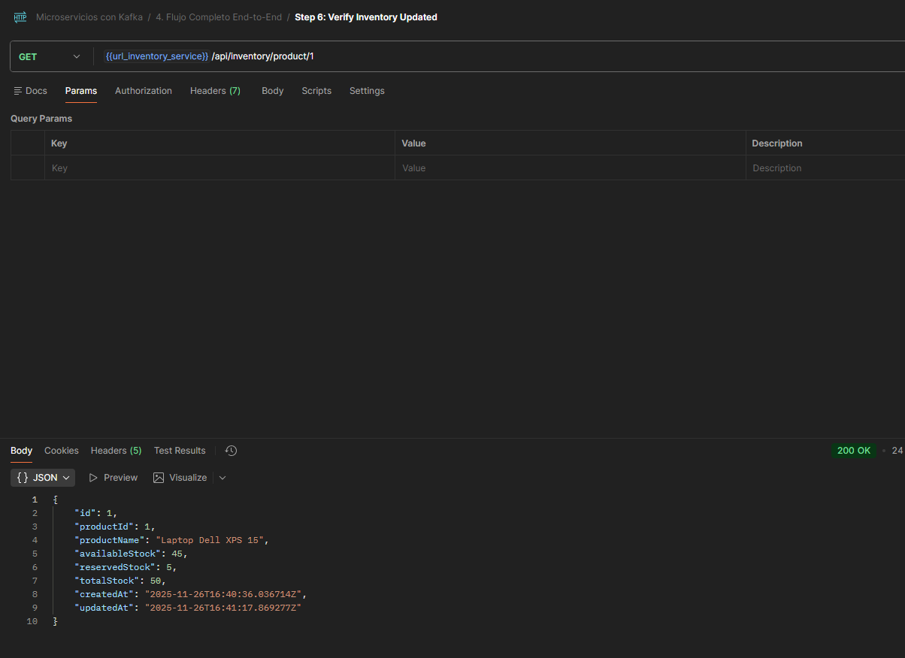

- Verificacion del estado de la orden

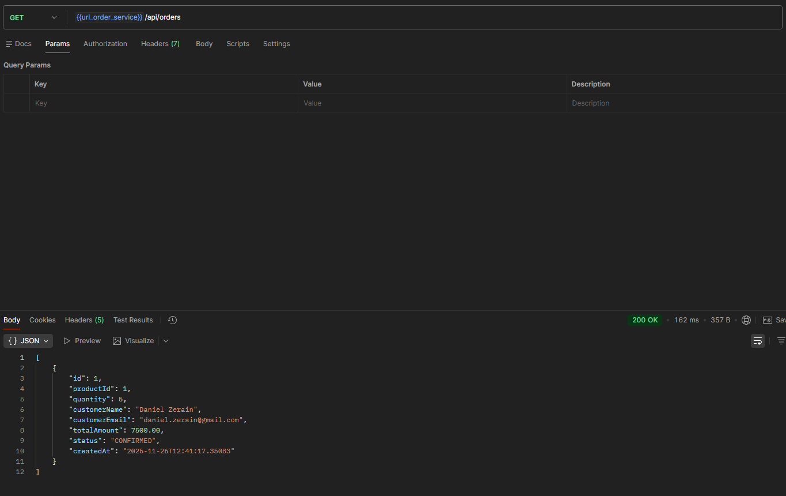

- Listado de las ordenes y su detalle

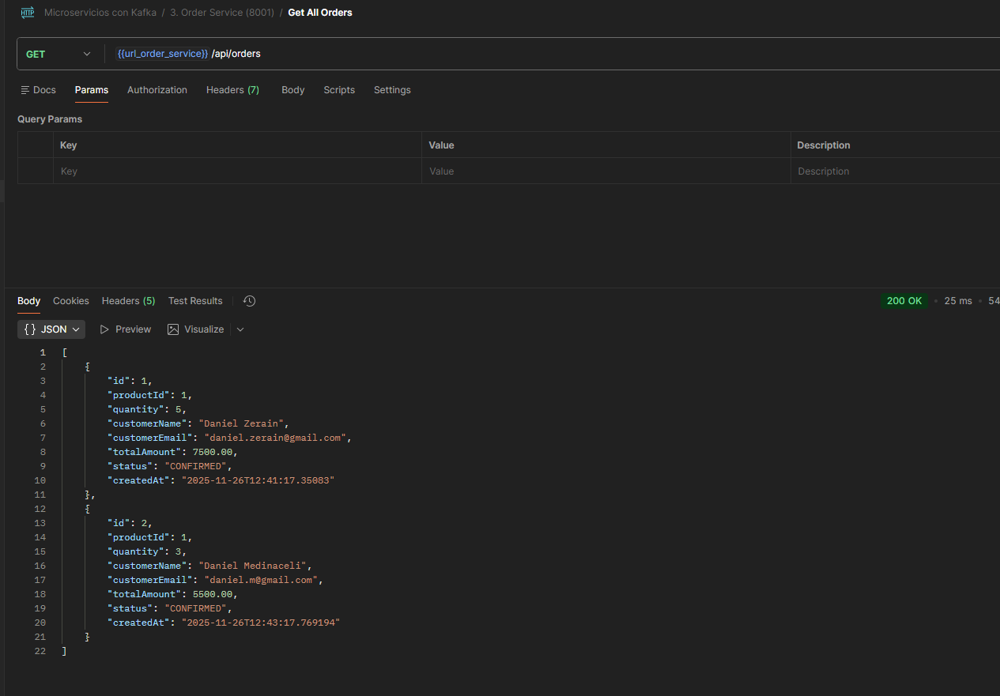

### Validacion y manejo de excepciones

Para todos los request se valida la informacion requerida, mostrando los mensajes con el datos incorrecto, del mismo modo se definieron excepciones en un formato estandar para todas las respuestas

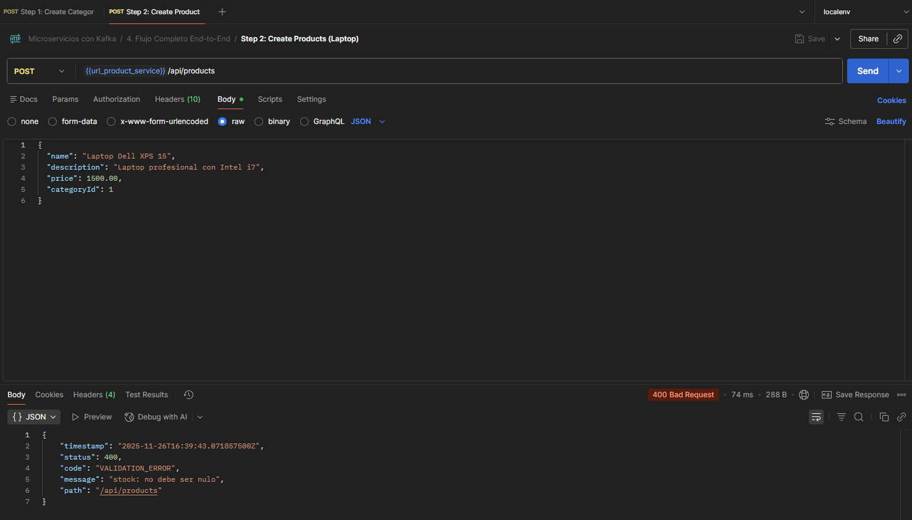

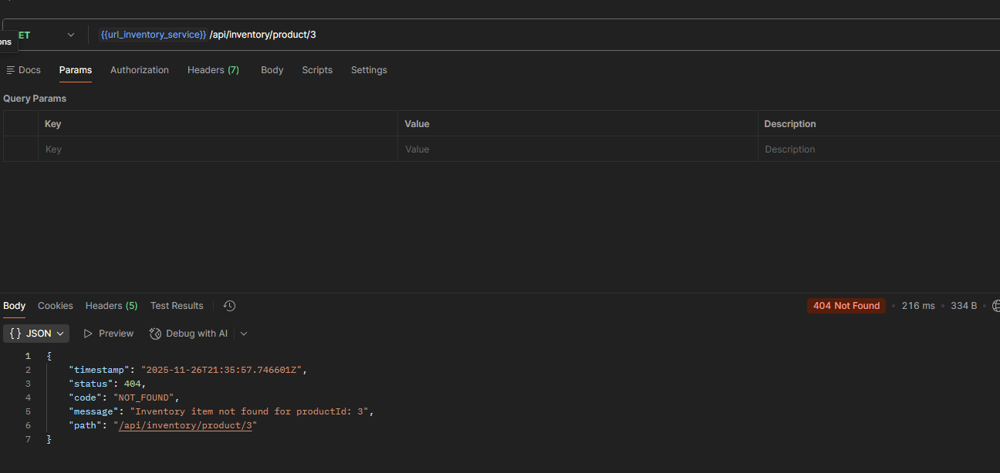

## Coleccion de Postman

La coleccion de postman actualizada puede descargarse desde: [postman](postman/postman_collection.json)

Adicionalmente puede descargar la configuracion del enviroment de postman desde: [postman environment](postman/postman_environment.json)

## Integracion Kafka

Apache Kafka se despliega en un contenedor, el docker-compose.yml debera tener la siguiente configuracion:

```bash
  kafka:
    image: confluentinc/cp-kafka:latest
    container_name: kafka
    ports:
      - "9092:9092"
    environment:
      KAFKA_NODE_ID: 1
      KAFKA_PROCESS_ROLES: broker,controller
      KAFKA_LISTENERS: PLAINTEXT://0.0.0.0:9092,CONTROLLER://0.0.0.0:9093
      KAFKA_ADVERTISED_LISTENERS: PLAINTEXT://localhost:9092
      KAFKA_CONTROLLER_LISTENER_NAMES: CONTROLLER
      KAFKA_LISTENER_SECURITY_PROTOCOL_MAP: CONTROLLER:PLAINTEXT,PLAINTEXT:PLAINTEXT
      KAFKA_CONTROLLER_QUORUM_VOTERS: 1@localhost:9093
      KAFKA_OFFSETS_TOPIC_REPLICATION_FACTOR: 1
      KAFKA_TRANSACTION_STATE_LOG_REPLICATION_FACTOR: 1
      KAFKA_TRANSACTION_STATE_LOG_MIN_ISR: 1
      KAFKA_GROUP_INITIAL_REBALANCE_DELAY_MS: 0
      KAFKA_AUTO_CREATE_TOPICS_ENABLE: "true"
      CLUSTER_ID: MkU3OEVBNTcwNTJENDM2Qk
    volumes:
      - ./kafka-data:/var/lib/kafka/data
    networks:
      - cursoksb_network
```

Todos los microservicios se conectan a Kafka para consumir y producir enventos, una vez levantada la instancia de kafka en docker, se deben crear los topicos, para esto se utilizo el cliente de kakfa y se ejecutaron los siguientes comandos:

```bash
kafka-topics --bootstrap-server localhost:9092 --create --topic ecommerce.inventory.updated --partitions 5  --replication-factor 1

kafka-topics --bootstrap-server localhost:9092 --create --topic ecommerce.orders.cancelled --partitions 5  --replication-factor 1

kafka-topics --bootstrap-server localhost:9092 --create --topic ecommerce.orders.confirmed --partitions 5  --replication-factor 1

kafka-topics --bootstrap-server localhost:9092 --create --topic ecommerce.orders.placed --partitions 5  --replication-factor 1

kafka-topics --bootstrap-server localhost:9092 --create --topic ecommerce.products.created --partitions 5  --replication-factor 1
```

Podemos consultar los topicos creados con el comando:

```bash
kafka-topics --bootstrap-server localhost:9092 --list
```

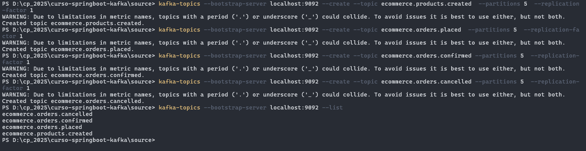

Podemos consultar el detalle de cada topico creado con el comando:

```bash
kafka-topics --bootstrap-server localhost:9092 --describe --topic ecommerce.products.created
```

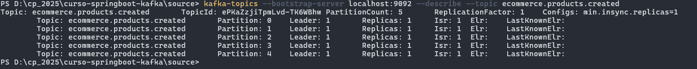

cuando se consumen los servicios se generar los eventos en kafka, como se muestra a continuacion el flujo de consumo:

**Eventos en Product_service**

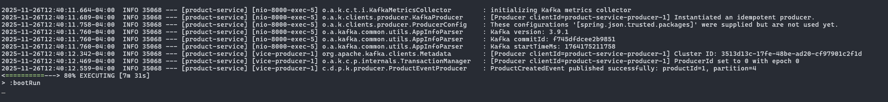

**Eventos en inventory_service**

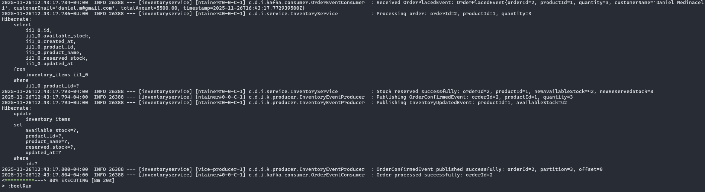

**Eventos en inventory_service**


## Base de datos

Se utiliza 1 base de datos para cada servicio, las mismas fueron creadas en la creacion del contenedor de docker

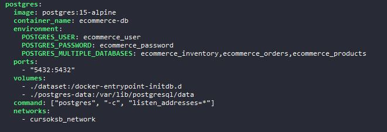

Se crean con el script:

```bash
#!/bin/bash

set -e
set -u

function create_user_and_database() {
    local database=$1
    echo "  Creando base de datos '$database'"
    psql -v ON_ERROR_STOP=1 --username "$POSTGRES_USER" <<-EOSQL
        SELECT 'CREATE DATABASE $database'
        WHERE NOT EXISTS (SELECT FROM pg_database WHERE datname = '$database')\gexec
EOSQL
}

if [ -n "$POSTGRES_MULTIPLE_DATABASES" ]; then
    echo "Solicitud de creación de múltiples bases de datos: $POSTGRES_MULTIPLE_DATABASES"
    for db in $(echo $POSTGRES_MULTIPLE_DATABASES | tr ',' ' '); do
        create_user_and_database $db
    done
    echo "Bases de datos creadas exitosamente"
fi
```

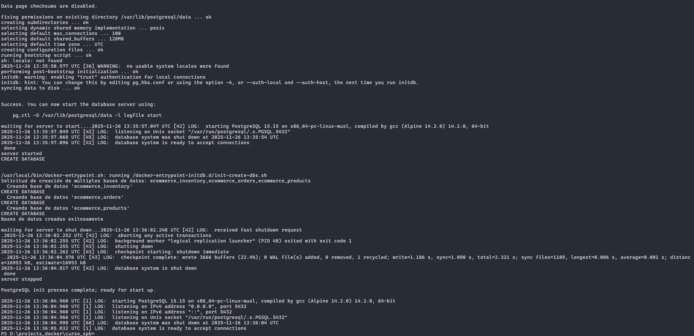

El mismo es registrado en la carpeta docker-entrypoint-initdb.d

Como se puede observar se crearon las bases de datos de los servicios

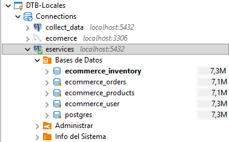

Se tienen las siguientes bases de datos

**ecommerce_inventory**

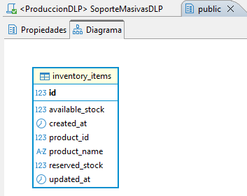

**ecommerce_orders**

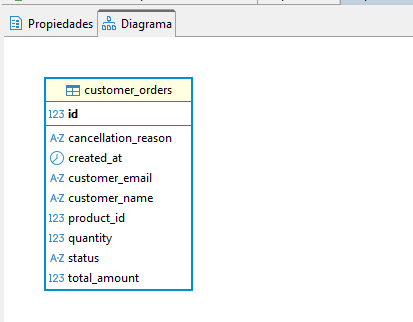

**ecommerce_products**

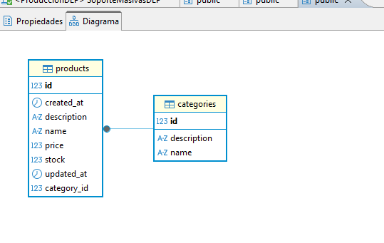

## Documentacion API

Se habilito la documentacion de las API con Swagger una vez que los servicios se encuentres arriba podran accederse desde las siguientes url:

**ecommerce_inventory**

> http://localhost:8002/swagger-ui/index.html

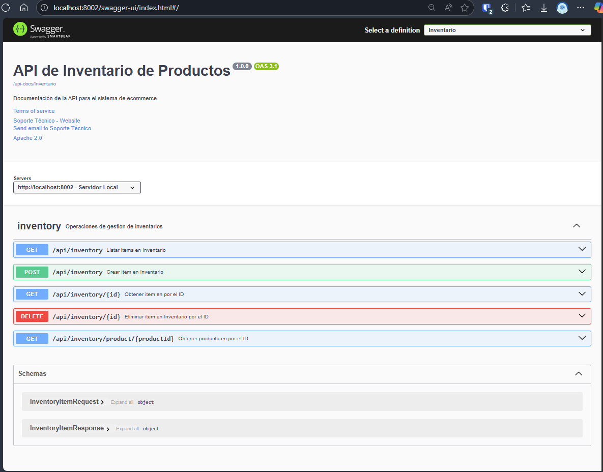

**ecommerce_orders**

> http://localhost:8001/swagger-ui/index.html

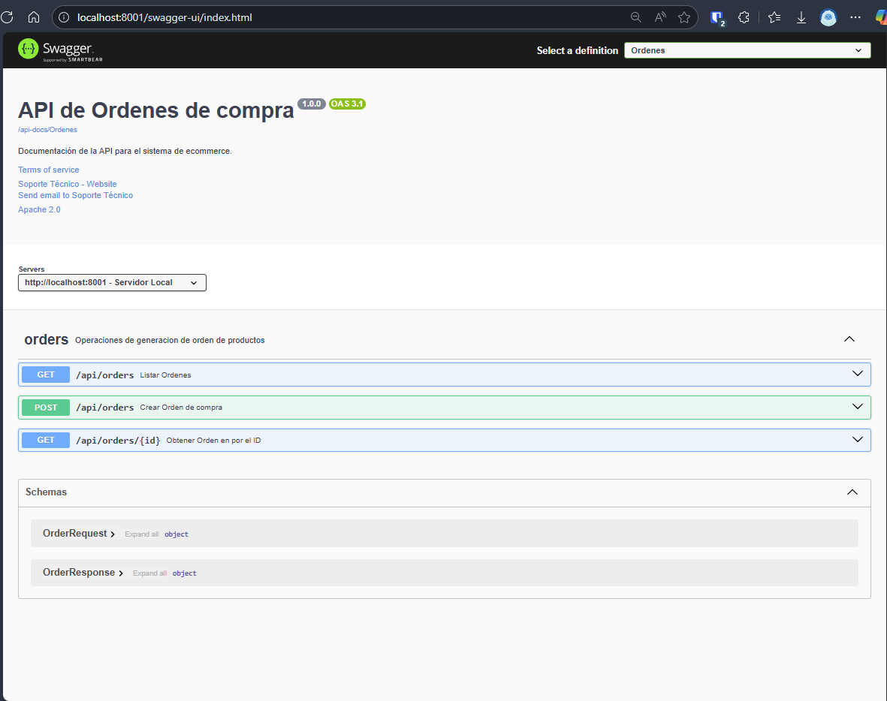

**ecommerce_products**

> http://localhost:8000/swagger-ui/index.html

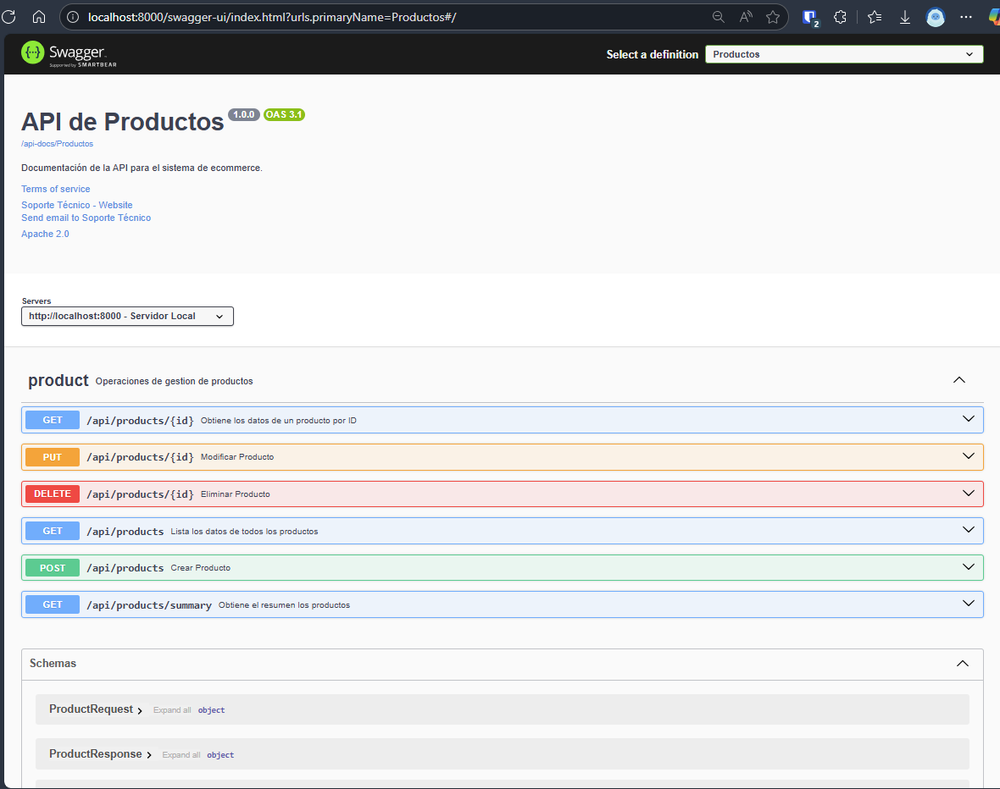
